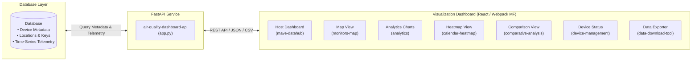

# Air Quality Data Visualization Dashboard

[](https://www.python.org/)
[](https://fastapi.tiangolo.com/)
[](https://reactjs.org/)
[](https://webpack.js.org/)

An open-source visualization dashboard platform designed to query, aggregate, and visualize air quality and environmental telemetry data from an existing database.

The platform provides a comprehensive suite of visualization tools—including geospatial maps, comparative trend charts, calendar heatmaps, device status monitors, and custom data export tools—backed by a lightweight FastAPI service.

---

## 📊 Visualization Features

- **Interactive Geospatial Map**: Visualize sensor locations, geographic clustering, live pollutant concentrations ($PM_{2.5}$, $PM_{10}$, temperature, humidity), and online/offline status.
- **Time-Series Analytics**: Line charts and regression analysis for historical pollutant trends with customizable rolling average windows.
- **Calendar Heatmap**: Daily and hourly exposure heatmaps to identify pollution patterns over time.
- **Comparative Analysis**: Side-by-side multi-parameter and multi-device comparative visualization.
- **Device Management & Status**: Overview table displaying device heartbeat status (online/offline based on a 5-minute threshold), battery levels, and power sources (`Mains`, `Solar`, `Battery`).
- **Data Export Tool**: Custom date-range query interface with paginated JSON and streamed CSV exports.
- **On-the-Fly Model Calibration**: Dynamically evaluates sensor calibration models (e.g. Z-score normalization for gas sensors like $CO$, $NO_2$, $O_3$, $SO_2$) before presenting data.

---

## 🏗️ Architecture

The platform connects to your existing database and serves visualization components through a microfrontend architecture:



---

## 📁 Repository Structure

```
unicef-os-codebase/
├── air-quality-dashboard-api/          # FastAPI Backend Service
│   ├── app.py                          # API routes, database queries, and data processing
│   ├── requirements.txt                # Python dependencies
│   ├── .env                            # JWT secrets & environment variables
│   ├── configs/
│   │   ├── Configurations.json         # Database connection settings
│   │   └── default_user_config.json    # Default UI metrics, labels, and map center
│   ├── data/
│   │   └── user_configs.json           # User-specific metric configurations
│   ├── database/
│   │   ├── connection.py               # Database connection & session management
│   │   ├── db_utils.py                 # Database query handlers (devices, user config)
│   │   └── telemetry_service.py        # Async time-series database query engine
│   └── utils/
│       └── gcs_models.py               # Dynamic model loader & calibration evaluator
│
└── frontend/                           # Visualization Microfrontends (Webpack 5)
    ├── mave-datahub/                   # [Port: your_frontend_port] Main Dashboard Shell & Navigation
    ├── auth-app/                       # [Port: your_frontend_port] Login & Authentication
    ├── outline/                        # [Port: your_frontend_port] Home Overview Dashboard
    ├── monitors-map/                   # [Port: your_frontend_port] Geospatial Map Visualization
    ├── analytics/                      # [Port: your_frontend_port] Time-Series Analytics & Trends
    ├── calendar-heatmap/               # [Port: your_frontend_port] Calendar Heatmap Visualization
    ├── comparative-analysis/           # [Port: your_frontend_port] Multi-Device Comparison Tool
    ├── data-download-tool/             # [Port: your_frontend_port] CSV/JSON Data Export Interface
    ├── device-management/              # [Port: your_frontend_port] Device Health & Status Table
    ├── display/                        # [Port: your_frontend_port] Public Kiosk / Display View
    ├── indoor-db/                      # [Port: your_frontend_port] Indoor Air Quality Dashboard
    ├── store/                          # [Port: your_frontend_port] Shared Store Remote
    └── ui-components-repository/       # [Port: your_frontend_port] Shared Design System Components
```

---

## 🚀 Quickstart

### Prerequisites

- **Python**: 3.10+
- **Node.js**: 18+ and `npm`
- **Database**: An active database instance configured with the required schema and telemetry tables

---

### 1. Configure and Run Backend (`air-quality-dashboard-api`)

1. **Navigate to the backend directory:**
   ```bash
   cd air-quality-dashboard-api
   ```

2. **Set up virtual environment & install dependencies:**
   ```bash
   python -m venv venv

   # Linux/macOS
   source venv/bin/activate

   # Windows
   venv\Scripts\activate

   pip install -r requirements.txt
   ```

3. **Configure Database Connection:**
   Edit `configs/Configurations.json` with your database connection details and credentials:
   ```json
   {
     "database_host": "your_database_host",
     "database_port": "your_database_port",
     "database_username": "your_database_username",
     "database_password": "your_database_password",
     "database_keyspace": "your_database_keyspace",
     "telemetry_host": "your_telemetry_host",
     "telemetry_port": "your_telemetry_port"
   }
   ```

4. **Set Environment Variables:**
   Update `.env`:
   ```env
   JWT_SECRET="your_jwt_secret"
   JWT_ALGO="HS256"
   GOOGLE_APPLICATION_CREDENTIALS="gcp_gcs.json"
   ```

5. **Start the API server:**
   ```bash
   uvicorn app:app --reload --host 0.0.0.0 --port your_backend_port
   ```
   API docs will be available at: `http://localhost:your_backend_port/docs`

---

### 2. Configure and Run Frontend (`frontend`)

1. **Install and run the shared UI component library:**
   ```bash
   cd frontend/ui-components-repository
   npm install
   npm start  # Runs on http://localhost:your_ui_port
   ```

2. **Install and run the main dashboard shell:**
   ```bash
   cd frontend/mave-datahub
   npm install
   npm start  # Runs on http://localhost:your_shell_port
   ```

3. **Run specific visualization modules (as needed):**
   Each visualization module can be run independently:
   - `frontend/monitors-map` (`http://localhost:your_map_port`)
   - `frontend/auth-app` (`http://localhost:your_auth_port`)
   - `frontend/data-download-tool` (`http://localhost:your_download_port`)
   - `frontend/analytics` (`http://localhost:your_analytics_port`)
   - `frontend/calendar-heatmap` (`http://localhost:your_heatmap_port`)
   - `frontend/comparative-analysis` (`http://localhost:your_comparison_port`)
   - `frontend/device-management` (`http://localhost:your_device_mgmt_port`)

---

## 📡 Database & API Overview

The backend reads data from database tables:
- **`keys`**: Stores user authentication credentials, assigned device IMEIs, and user preferences.
- **`locationdatatable`**: Stores device coordinates (latitude, longitude), locality, city, state, and status.
- **`parameters_table`**: Stores metric definitions, display labels, and units.
- **Time-Series Telemetry**: Queries time-series values for telemetry parameters ($PM_{2.5}$, $PM_{10}$, temperature, humidity, etc.).

### Key Endpoints

| Method | Endpoint | Description |
| :--- | :--- | :--- |
| `POST` | `/login` | Authenticates user against the database `keys` table and returns JWT. |
| `GET` | `/user_config/{username}` | Returns dashboard settings (priority metrics, map center, zoom level). |
| `GET` | `/getMapData/username/{user_name}` | Fetches device coordinates, live readings, and online/offline status for map visualization. |
| `GET` | `/getDeviceStatus/username/{user_name}` | Fetches device health, battery levels, and power sources. |
| `GET` | `/getDeviceDataParam/...` | Fetches aggregated time-series telemetry from the database formatted as CSV or JSON. |
| `GET` | `/getDeviceDataParamPage/...` | Paginated time-series queries for large device networks. |

---